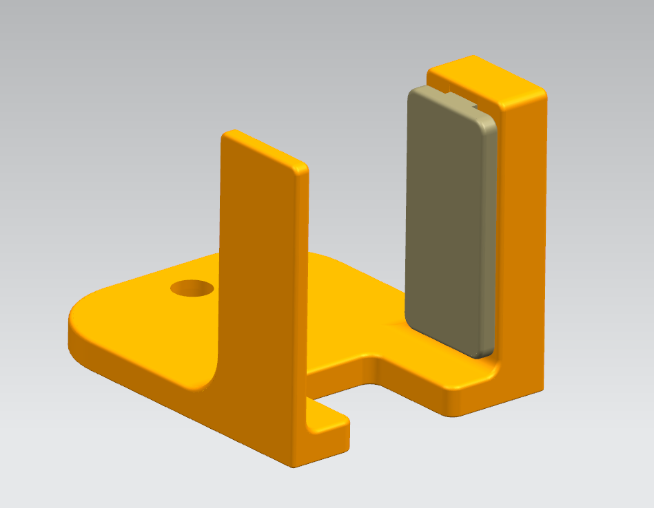

# Tripod Mount Fixed Bracket Clip

Easy for you to mount your CocoRobo Modules. Check out the `stl` folder to download the 3D models. Below are the additional components that need to be assembled with the 3D-printed parts:

- 1/4 to 3/8 Converter Screw Adapter for Tripod (1/4互转3/8转接螺丝转换螺帽)
- 304 Stainless Steel Compression Spring (304不锈钢弹簧)

## Assembled view

## 3D-printed view

